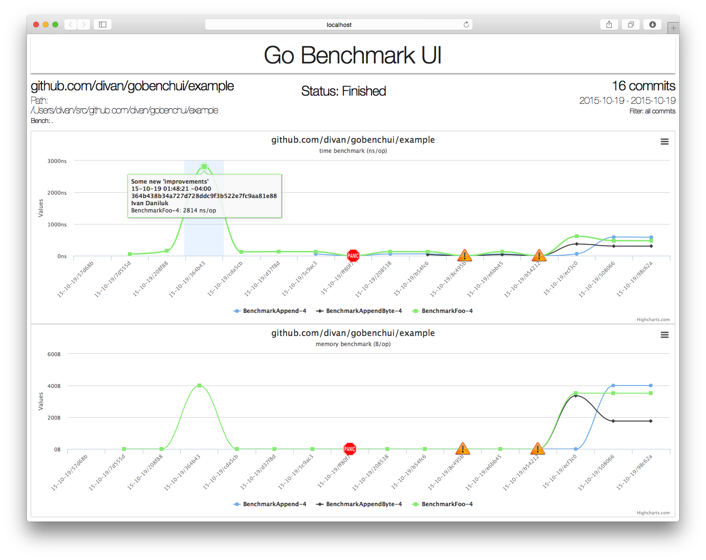

# GoBenchUI

UI for overview of your package benchmarks progress.

## Intro

GoBenchUI does one simple thing - it copies your package into temporary directory, checks out every commit in source control history and run benchmarks for this version. It presents results on [highcharts.js](http://www.highcharts.com) based web UI in realtime.

 

## Features

* nice web based UI with animation, tooltips, icons and realtime status update
* separate time and memory charts
* export chart to PNG, JPEG, PDF or SVG formats
* supports Git and Mercurial version control
* supports projects that use [gb](http://getgb.io) or GO15VENDOREXPERIMENT vendoring
* advanced commits filtering
* supports regexps for benchmarks
* handles build errors and panics

## Installation

Just go get it:

    go get -u github.com/divan/gobenchui

## Usage

To run benchmarks, simply specify package name:

    gobenchui -last 10 github.com/jackpal/bencode-go

or, if you're inside this directory, use `.`:

    cd $GOPATH/github.com/jackpal/bencode-go
    gobenchui -last 10 .

Browser will pops up. If not, follow instructions printed to console.

## Filtering commits

#### Basic filtering

By default, gobenchui will run benchmarks over all commits in repository. You may want to limit commits amount to last N commits only. Use `-last` option:

    gobenchui -last 20 .

If the number of commits is huge, but you want to get overview for complete project history, you may use `-max` option. It tries to divide all commits to N equal blocks, spread it as equally as possible and guarantee that you'll get overview for exactly N commits:

    gobenchui -max 15 .
    
You also may use `-last` and `-max` in conjunction, to, say, get maximum 10 commits overview from last 100:

    gobenchui -max 10 -last 100 .

#### VCS specific filtering

If you need more powerful commits filtering, you can pass arbitrary arguments to you VCS command with `-vcsArgs`. Say, for `git`, you may specify:

    gobenchui -vcsArgs "--since=12.hours" .

to get commits from the last 12 hours. Or:

    gobenchui -vcsArgs "--author Ivan --since 2.weeks --grep bench" .
    
to get all commits by author 'Ivan' for the last 2 weeks that has word "bench" in commit message. Or:

    gobenchui -vcsArgs "--no-walk --tag" .
    
to get only commits where tag was added.

In other words, it's really powerful way to select only needed commits. See this [git book chapter](https://git-scm.com/book/en/v2/Git-Basics-Viewing-the-Commit-History) for more details.

Note, that gobenchui will filter out args that may modify output (like `--pretty` or `--graph`), because fixed formatting is used for parsing output.

## Benchmark options

In the same manner you may pass additional options to benchmarking tool. Typically you only need to specify regexp for benchmark functions:

    gobenchui -bench Strconv$ .
    
It uses the same regexp rules as `go test` tool. You may also add additional flags like `-short`.

## Vendoring support

`gobenchui` supports gb and GO15VENDOREXPERIMENT out of the box. It can be extended to support more vendoring solutions, as it has proper interface for that.

It tries to detect right tool on each commit, so if you introduced vendoring recently, older benchmarks would work also (just make sure, needed packages still in your GOPATH before running benchmarks).

I didn't test heavily that part, so there may be some bugs or corner cases I'm not aware of.

## Known issues

 * in case where latest commits has broken test, they will not appear in chart
 * may be issues with internal/ subpackages
 * chart icons for errors aren't exported correctly

## Contribute
 
My frontend JS code sucks, just because, so if you want to design and implement new better web UI - you're more than welcome.

Make sure to run `go generate` to regenerate assets. Or use GOBENCHUI_DEV env variable to read assets from filesystem.

## Afterwords

Hopefully, this tool will bring more incentive to write benchmarks.

## License

This program is under [WTFPL license](http://www.wtfpl.net)
